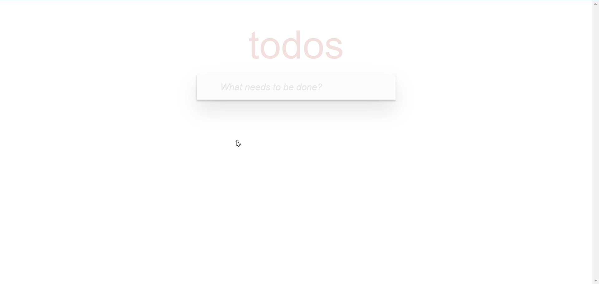

# React Todo App Documentation

## Introduction

The React Todo App is a robust and user-friendly application designed to help users manage their tasks efficiently. With features like adding, deleting, updating, selecting all, and clearing completed tasks, this app provides a seamless interface for organizing daily activities. Users can filter tasks by completed and active status. User data is stored locally, while other tasks are saved on a backend server.

### [🚀 DEMO](https://bojkovladislav.github.io/todo-app/)

**Sections:**

- [Features](#features)
- [Technologies](#technologies)

## Features

Explore the exciting features that make the React Todo App stand out:

### Adding Todo 📝

Users can easily add new tasks to their todo list, providing a quick and efficient way to capture their thoughts and responsibilities.

### Deleting Todo 🗑️

Seamlessly delete tasks that are no longer needed, helping users maintain a clean and organized todo list.

### Updating Todo 🔄

Efficiently update task details, allowing users to modify task descriptions or due dates as needed.

### Selecting All Todos ✔️

Selecting all todos with a single click enables users to perform bulk actions, saving time and effort.

### Clear Completed Todos 🧹

Easily clear completed tasks from the todo list, providing a clutter-free view of active tasks.

### Filtering by Status 🔄

Users can filter tasks by completed and active status, gaining a clear view of their progress and remaining tasks.

## Technologies

The React Todo App leverages a powerful stack of technologies:

### React.js

Built with React.js library, ensuring a modular and efficient development process.

### TypeScript 📝

Developed using TypeScript for static typing, enhancing code quality and developer productivity.

### Axios 🌐

Incorporates Axios for efficient HTTP requests, enabling seamless communication with the backend server.

### Local Storage

Utilizes local storage to persistently store and retrieve user preferences, such as the selected theme, and user-generated todos.

## [🔝 Back to Top](#react-todo-app-documentation)
